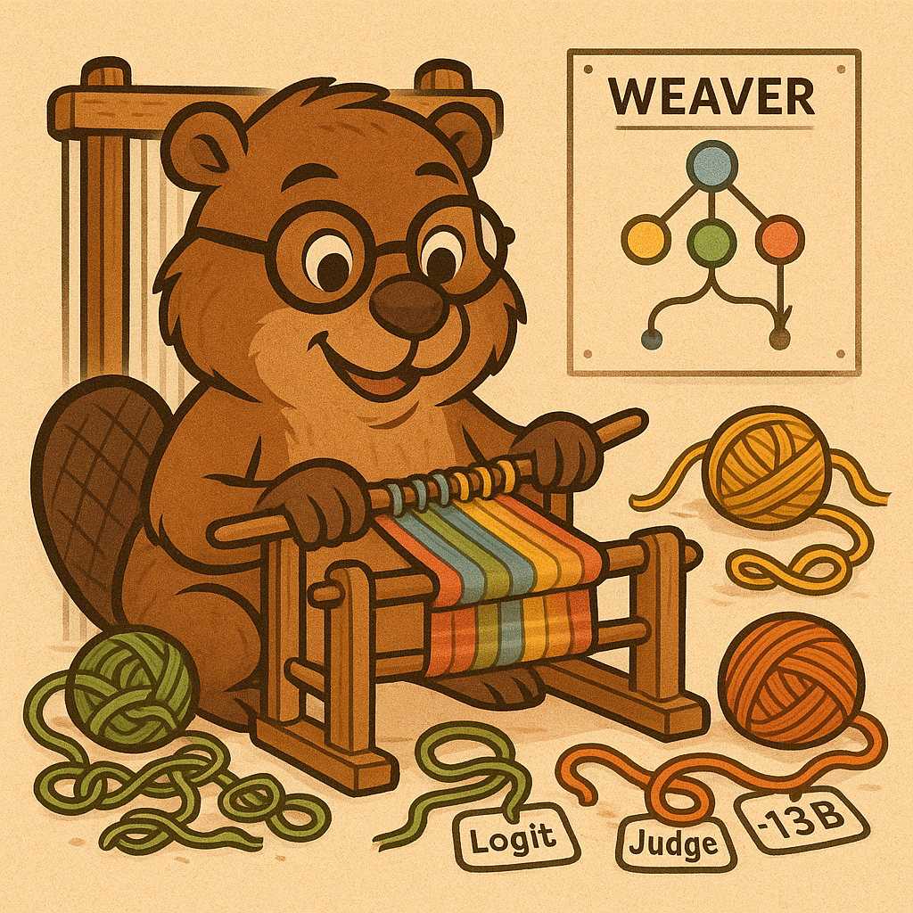

<div align="center">
    
  
  [](https://github.com/hazyresearch/scaling-verification/blob/main/LICENSE)
  [](https://arxiv.org/abs/2506.18203)
</div>

# Shrinking the Generation-Verification Gap with Weak Verifiers

> 📄 [Paper](https://arxiv.org/abs/2506.18203)    
> 🤗 [Datasets and Models](https://huggingface.co/collections/hazyresearch/weaver-683798010b39c9653ddb9bd8)    
> 📝 [Blog Post](https://hazyresearch.stanford.edu/blog/2025-06-18-weaver) 

Weaver is a framework for designing a strong verifier by combining multiple weak, imperfect verifiers. To reduce the dependency on labeled data, Weaver leverages weak supervision to estimate each verifier’s accuracy and combines their outputs into a unified score that better reflects true response quality. Weaver significantly improves the pass@1 performance across several reasoning and math tasks, achieving o3-mini-level accuracy with Llama 3.3 70B Instruct as the generator, and an ensemble of smaller judge and reward models as the verifiers.

## Quick Start

### Installation

**1. Clone the repository:**
```bash
git clone https://github.com/ScalingIntelligence/scaling-verification.git
cd scaling-verification
```

**2. Create a Python environment (Python 3.10+ required):**
```bash
conda create -n weaver python=3.11
conda activate weaver
```

**3. Install Weaver and dependencies:**
```bash
# Install dependencies
pip install -e .

# Grab pre-built CUDA wheel that matches driver
pip install torch torchvision torchaudio \
  --index-url https://download.pytorch.org/whl/cu124

# [Optional] Installs FlashAttention for faster GPU inference. Skip it if you only need CPU or generic CUDA
pip install -e ".[cuda]"

# Install metal-ama for weak supervision (required)
git clone https://github.com/mayeechen/metal-ama.git
cd metal-ama
pip install -e .
cd ..
```

**4. Verify installation:**
```bash
python test_installation.py
```

**5. API Keys:**

While not strictly necessary, we recommend you export these API Keys:
```bash
export OPENAI_API_KEY="your-key"
export TOGETHER_API_KEY="your-key"
export WANDB_ENTITY="your-wandb-entity"
```

**6. Setup WANDB and HuggingFace**

To ensure WANDB works, we recommend you login before starting the process:
```bash
wandb login
```

To ensure your HuggingFace works, we recommend you perform either of the following commands
```bash
export HF_TOKEN="your_HF_token_here"
huggingface-cli login
```

### Optional Dependencies

For development and additional features:
```bash
# Development tools
pip install -e ".[dev]"

# Jupyter notebooks and full environment
pip install -e ".[full]"
```

## Run Weaver

Weaver consists of three main stages, each of which are described below:

We provide publicly available datasets that already contain the data from full runs of stage 1 and stage 2. This means you can skip directly to stage 2 if you would like to quickly reproduce our main results. We also provide off-the-shelf models produced by running stage 3 on our datasets.

Check out [example.sh](example.sh) for an example sequence of commands to run weaver end to end on a small set of data.

### 1. **Generation**
Generate reasoning samples, collect verifier scores for benchmark problems, store in a Huggingface dataset.

**What it does:** Takes benchmark datasets (MATH, GPQA, MMLU, MMLU-Pro) and generates multiple reasoning responses using an LLM of choice, then evaluates them with various reward models and LM judges.

**Key scripts:**
- `generate_reasoning_samples.py` - Generate model responses
- `unified_evaluation.py` - Extract answers and check correctness
- `unified_RMs_and_LM_Judges.py` - Score model responses with verifiers

**[See generation/README.md for detailed instructions →](generation/README.md)**

### 2. **Selection**
Train and evaluate Weaver, along with baseline methods, for response selection.

**What it does:** Uses the datasets from stage 1 to train Weaver models that use weak verifier scores to select the best response from multiple candidates, comparing against baselines like majority voting and supervised methods.

**Key script:** `run.py`

**[See selection/README.md for detailed instructions →](selection/README.md)**

### 3. **Distillation**
Distill Weaver's ensemble into a compact 400M parameter model.

**What it does:** Trains a lightweight cross-encoder model that captures 98.7% of Weaver's accuracy while reducing compute by 99.97%, making verification practical for deployment.

**Key scripts:**
- `train.py` - Train distilled model
- `evaluate.py` - Evaluate performance

**[See distillation/README.md for detailed instructions →](distillation/README.md)**

## Pre-trained Models & Datasets

We provide ready-to-use datasets and models in our Hugging Face [collection](https://huggingface.co/collections/hazyresearch/weaver-release-683798010b39c9653ddb9bd8):

**Datasets:**
- MATH-500, GPQA, MMLU, MMLU-Pro with Llama-3.1 (70B & 8B) generations
- Pre-scored with 15+ reward models and LM judges
- Includes final verification scores from our best Weaver configuration

**Distilled Models:**
- 5 models distilled for various tasks from various base models

## Troubleshooting

**Import errors:**
```bash
# Make sure you're in the right directory and environment
conda activate weaver
cd /path/to/weaver
pip install -e .
```

**CUDA/GPU issues:**
```bash
# Check PyTorch CUDA installation
python -c "import torch; print(torch.cuda.is_available())"
```

**Metal-ama installation issues:**
```bash
# Re-install metal-ama
cd metal-ama
pip install -e . --force-reinstall
```

## Citation

If you use this work, please cite:
```bibtex
@misc{saadfalcon2025shrinkinggenerationverificationgapweak,
      title={Shrinking the Generation-Verification Gap with Weak Verifiers}, 
      author={Jon Saad-Falcon and E. Kelly Buchanan and Mayee F. Chen and Tzu-Heng Huang and Brendan McLaughlin and Tanvir Bhathal and Shang Zhu and Ben Athiwaratkun and Frederic Sala and Scott Linderman and Azalia Mirhoseini and Christopher Ré},
      year={2025},
      eprint={2506.18203},
      archivePrefix={arXiv},
      primaryClass={cs.CR},
      url={https://arxiv.org/abs/2506.18203}, 
}
```
